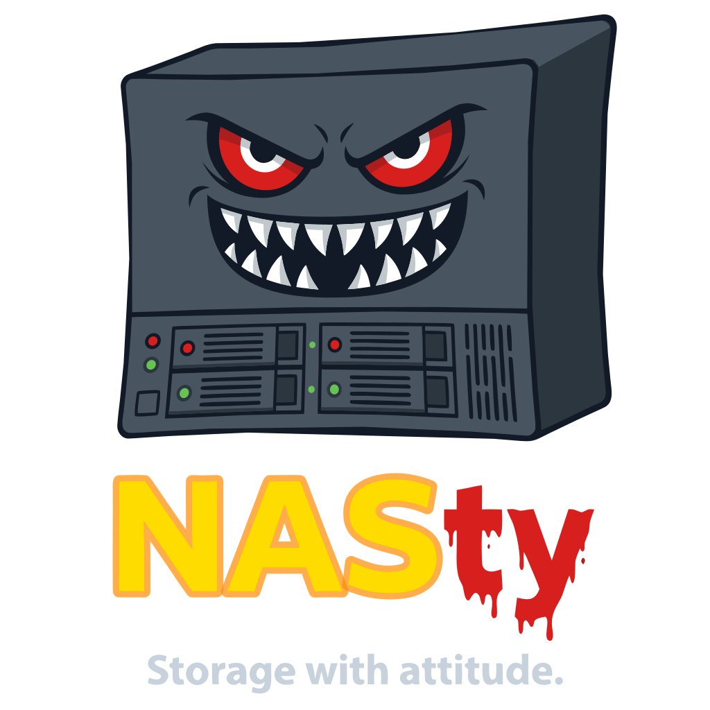
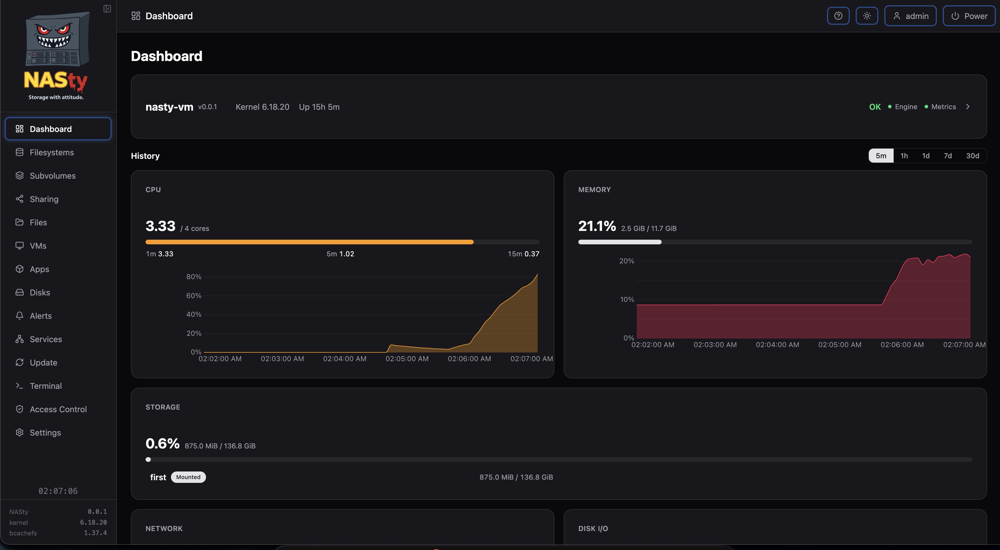
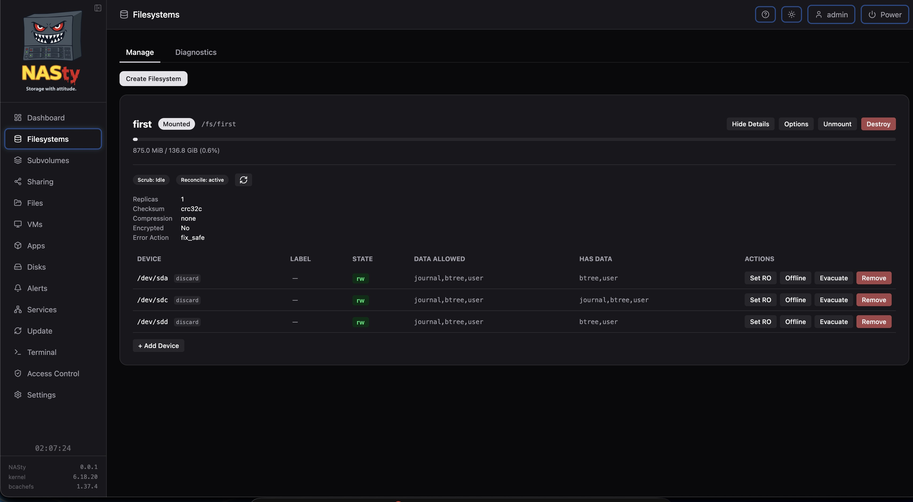
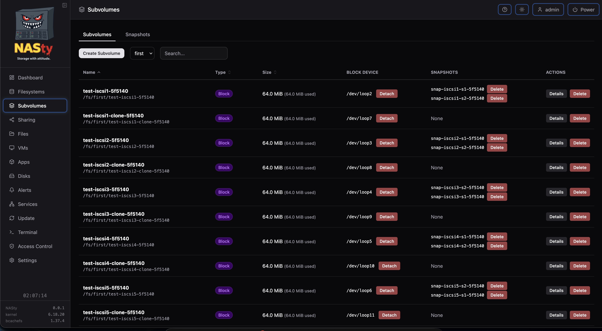
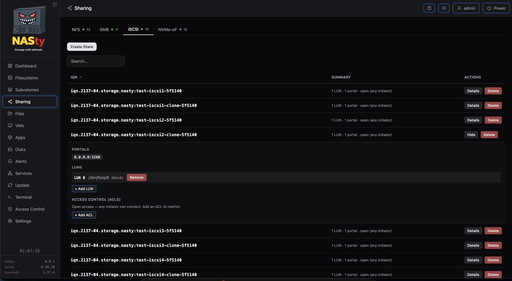
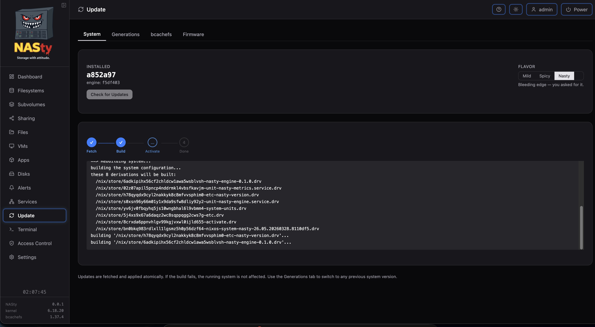
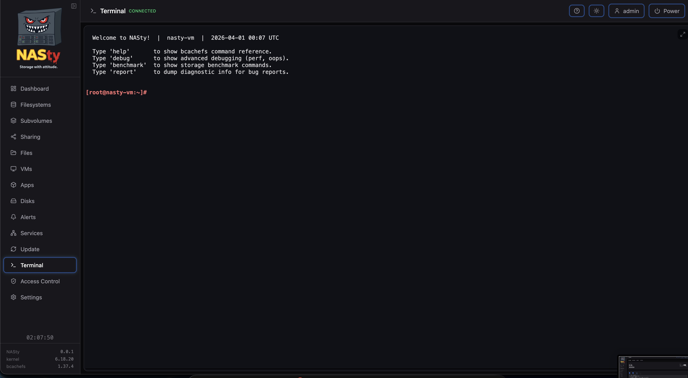

<p align="center">
  <picture>
    <source media="(prefers-color-scheme: dark)" srcset="webui/src/lib/assets/nasty-white.svg" />
    <source media="(prefers-color-scheme: light)" srcset="webui/src/lib/assets/nasty.svg" />
    
  </picture>
</p>

<p align="center">
  <strong>A vibecoded NAS appliance built on bcachefs.</strong><br>
  Released on April 1st. Not a joke. Probably.
</p>

---

NASty is a self-contained NAS operating system built entirely through vibecoding. One human making decisions, one AI writing code, and a mass of caffeine turning commodity hardware into something that stores your data and serves it over every protocol invented since the 90s.

## Features

- **bcachefs** — yes, you read that right — compression, checksumming, erasure coding, tiering, encryption, O(1) snapshots
- **File sharing** — NFS, SMB — managed from one UI
- **Block storage** — iSCSI, NVMe-oF — because sometimes you need raw blocks
- **Web UI** — manage filesystems, subvolumes, snapshots, shares, disks, VMs, and more
- **Web terminal** — built-in shell access from the browser
- **Virtual machines** — QEMU/KVM with VNC console *(here be dragons)*
- **Apps** — k3s-based container runtime *(here be bigger dragons)*
- **Alerts** — configurable rules for filesystem usage, disk health, temperatures
- **Kubernetes integration** — CSI driver for dynamic volume provisioning across all 4 protocols
- **Atomic updates** — NixOS-based, with one-click rollback to any previous generation
- **File browser** — browse and manage files on your filesystems from the web UI

## Screenshots

<p align="center">
  
</p>
<p align="center"><em>Dashboard</em></p>

<p align="center">
  
</p>
<p align="center"><em>Filesystems</em></p>

<p align="center">
  
</p>
<p align="center"><em>Subvolumes</em></p>

<p align="center">
  
</p>
<p align="center"><em>Sharing</em></p>

<p align="center">
  
</p>
<p align="center"><em>Updates</em></p>

<p align="center">
  
</p>
<p align="center"><em>Terminal</em></p>

## Getting Started

1. Download the latest ISO from [Releases](../../releases)
2. Boot it on your hardware — the "installer" (generous term) lets you pick a disk and press Enter
3. Open the WebUI at `https://<nasty-ip>`
4. Default credentials: **admin** / **admin**

## Update Flavors

NASty has three update flavors. All of them will eventually break something. The only question is how fast.

| Flavor | What you get | Description |
|--------|-------------|-------------|
| **Mild** | Tagged stable releases (`v0.0.1`) | Tested once. Probably fine. |
| **Spicy** | Pre-release builds (`s0.0.1`) | Moves fast, breaks things. You were warned. |
| **Nasty** | Latest commit on main | `git pull && pray`. No refunds. |

Switch flavors from **Settings → Update → Flavor** in the WebUI.

## Architecture

| Component | Technology | Why |
|-----------|------------|-----|
| Engine | Rust | Fast, safe, and the compiler yells at you so users don't have to |
| Web UI | SvelteKit + TypeScript | React was too mainstream |
| OS | NixOS | Because normal package managers are too predictable |
| Filesystem | bcachefs | See "yes, you read that right" above |
| Glue | JSON-RPC 2.0 over WebSocket | REST is for people who like latency |

## Project Structure

```
engine/         The part that actually works (Rust)
webui/          The part that looks pretty (SvelteKit)
nixos/          The part that makes updates terrifying (NixOS)
```

The full ecosystem (CSI driver, Helm chart, kubectl plugin, and more) lives at [github.com/nasty-project](https://github.com/nasty-project).

## FAQ

See [FAQ.md](FAQ.md) — answers to questions like "are you insane?" and "is bcachefs production ready?" (spoiler: no and no)

## Telemetry

I spy on you. Just kidding. I count drives and storage usage. That's literally it. I just want to know if anyone actually uses this thing. Disable anytime from **Settings → Telemetry**. Full disclosure at [nasty-telemetry](https://github.com/nasty-project/nasty-telemetry).

## License

GPLv3
